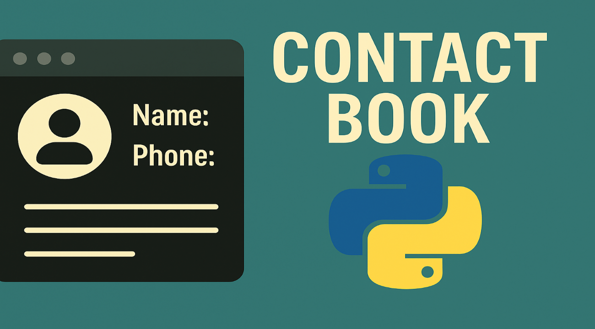

# ☎️Command Line Contact Book
This program enables users store and manage their contacts via the command line.
It is built with pure python.

## ⚡Features
- Add Contacts.
- View Contacts.
- Delete Contacts.

## 📜How to Use
- Ensure you have python 3 installed.
- Clone this repository
- Navigate to the project folder in command prompt or shell.
- Run 
```
python contacts_app.py
```
- Follow the instructions from the program for best use.
- Use `create` to add a new contact.
- Use `view` to search for a contact.
- Use `delete` to delete a contact.
- Use `help` to get instructions.
- Use `exit` to close the program

## ▶️Live Demo
[](https://youtu.be/xDRBwOnMGw0)

## 📞Contact
Feel free to reach me on [X](x.com/Ndigitals001) for collaboration or inquiry.

